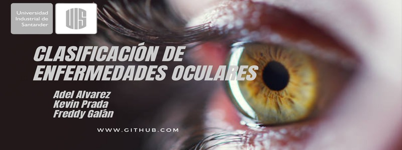

# Clasificación enfermedades oculares - IA2

## Autores:

Adel Mauricio Álvarez Amado, Fredy Santiago Galán, Kevin Alexis Prada Morales

## Objetivo
Clasificar las enfermedades oculares como; retinopatía diabética, catarata, glaucoma y normal.

## Dataset (eye_diseases)
El dataset consta de imágenes retinales normales, de retinopatía diabética, de cataratas y de glaucoma, donde cada clase tiene aproximadamente 1000 imágenes. Estas imágenes se recopilan de varias fuentes como IDRiD, reconocimiento Oculur, HRF, etc.
https://www.kaggle.com/datasets/gunavenkatdoddi/eye-diseases-classification

## Dataset (Glaucoma_dataset)
El dataset consta de imágenes de glaucoma que utilizamos para balancear el dataset para el problema de "otras vs glaucoma" (sub-problema)
https://www.kaggle.com/datasets/sreeharims/glaucoma-dataset

## Modelos
GaussianNB, DecisionTree, RandomForest, SVM (Poly, sigmoid, rbf) y red neuronal (DNN)

## Enlace del código
https://colab.research.google.com/drive/1Lq67ASNTii6tPVQuGlATg08n1qCDVvMg?usp=sharing

## Enlace del video

## Enlace de las diapositivas
[https://docs.google.com/presentation/d/12uk3mcWkkE1C_rq444p9meLV0wJsxqvp/edit?usp=sharing&ouid=113750339374582185665&rtpof=true&sd=true](https://docs.google.com/presentation/d/18kf-hz5rOYpaQJAWxi0LsMfA95cLhMpU/edit?usp=sharing&ouid=100139864134662243815&rtpof=true&sd=true)
